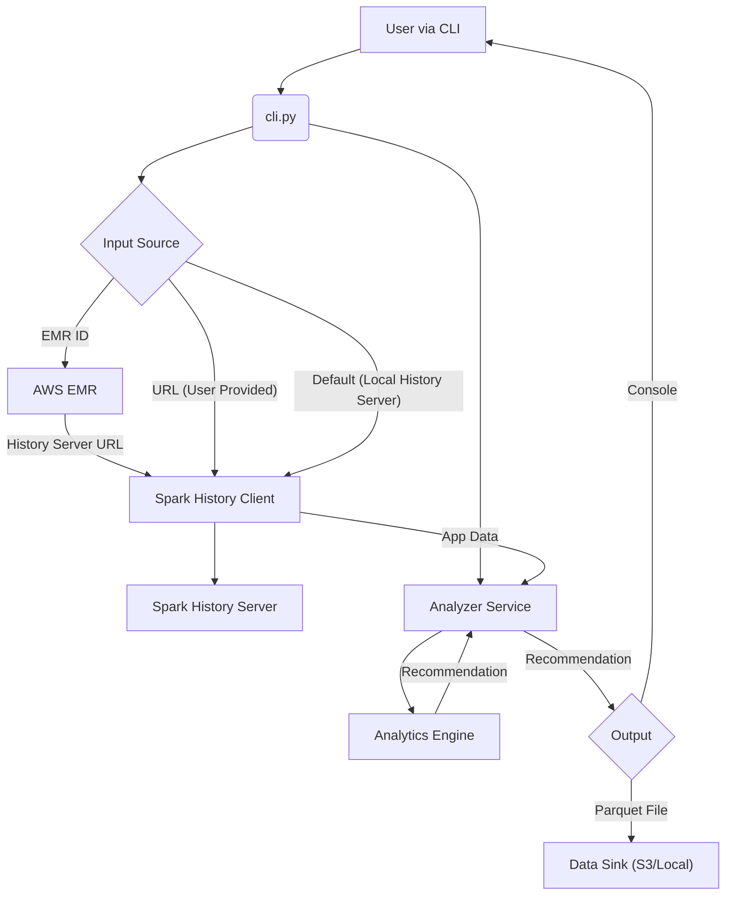

# Spark Application Analyzer

A Python package to analyze Spark Application (Spark 3.5 running on AWS EMR) metrics via REST API to suggest the right sizing for executors.

> The major implementation of the project is complete.

## Overview

This project implements a right-sizing framework for Spark executors, inspired by [LinkedIn's Right-Sizing Executor Design](https://www.linkedin.com/blog/engineering/infrastructure/right-sizing-spark-executor-memory). The framework analyzes historical Spark application metrics to automatically determine optimal executor memory configurations.

## Features

- **Automatic Metric Collection**: Fetches executor metrics from Spark History Server via REST API
- **EMR Integration**: Automatically discovers history server endpoints using EMR cluster ID
- **Memory Analysis**: Calculates p50, p90 percentiles for heap, total, and overhead memory
- **Right-Sizing Recommendations**: Implements LinkedIn-inspired formulas with dynamic buffer sizing
- **T-Shirt Sizing**: Maps recommendations to configurable cluster profiles (XSMALL to XLARGE)
- **Multiple Output Formats**: JSON output, Parquet storage, and human-readable logs
- **Rich Terminal UI**: Modern, visually appealing CLI output with tables and panels using the `rich` library
- **CLI-First Design**: Easy-to-use command-line interface for automation
- **MCP Server**: Built-in Model Context Protocol server for AI assistant integration

## Installation

### Prerequisites

- Python 3.8+
- Access to Spark History Server (local or remote)
- AWS credentials (if using EMR integration)

### Install from Source

```bash
git clone <repository-url>
cd spark-application-analyzer
pip install -e .
```

### Install Dependencies

```bash
pip install -r requirements.txt
```

## Quick Start

### Basic Usage

```bash
# Analyze a specific application
spark-analyzer --app-id app-123 --base-url http://localhost:18080

# Analyze all completed applications
spark-analyzer --all-apps --base-url http://localhost:18080

# Save results to a specific path
spark-analyzer --app-id app-123 --base-url http://localhost:18080 --sink-path ./results
```

### EMR Integration

```bash
# Automatically discover history server from EMR cluster
spark-analyzer --emr-id j-1234567890 --app-id app-123 --sink-path s3://bucket/folder/

# Analyze all apps on an EMR cluster
spark-analyzer --emr-id j-1234567890 --all-apps
```

### MCP Server

The package includes a Model Context Protocol (MCP) server that allows AI assistants (like Claude or IDE agents) to directly interact with the analyzer.

```bash
# Start the MCP server
spark-analyzer-mcp
```

**Available Tools:**
- `analyze_spark_app`: Generate recommendations and identify bottlenecks
- `list_spark_apps`: List applications from history server
- `get_spark_app_details`: Get full application details
- `get_spark_environment`: Get environment properties
- `get_spark_executors`: Get executor metrics
- `get_spark_jobs`: Get job metrics
- `get_spark_stages`: Get stage metrics

## Configuration

### T-Shirt Sizing Profiles

Create a `config.yaml` file to define your cluster profiles:

```yaml
tshirt_profiles:
  XSMALL:
    max_memory_gb: 4
    max_cores: 2
  SMALL:
    max_memory_gb: 8
    max_cores: 4
  MEDIUM:
    max_memory_gb: 16
    max_cores: 8
  LARGE:
    max_memory_gb: 32
    max_cores: 16
  XLARGE:
    max_memory_gb: 64
    max_cores: 32
```

## Architecture

```
spark_application_analyzer/
├── collectors/          # Metric collection from Spark History Server
├── models/             # Data models for metrics and recommendations
├── analytics/          # Memory analysis and right-sizing logic
├── storage/            # Arrow/Parquet storage and persistence
├── config/             # T-shirt sizing and configuration management
├── utils/              # Utility functions and helpers
├── cli.py             # Command-line interface
└── api.py             # Programatic interface
```

## Architecture Diagram



## Right-Sizing Logic

The framework implements LinkedIn's approach with the following key features:

### Memory Calculation
- **MAX_HEAP_MEMORY**: Peak JVM heap memory usage
- **MAX_TOTAL_MEMORY**: Total process memory from ProcessTree metrics
- **MAX_OVERHEAD_MEMORY**: Calculated as difference between total and heap

### Buffer Strategy
- **< 8 executions**: 25-30% buffer (conservative approach)
- **≥ 8 executions**: 10-15% buffer (aggressive optimization)

### Formulas
```
SUGGESTED_HEAP = p90(MAX_HEAP_MEMORY) + BUFFER * (p90_HEAP / p90_TOTAL)
SUGGESTED_OVERHEAD = p90(OVERHEAD_MEMORY) + BUFFER * (p90_OVERHEAD / p90_TOTAL)
```

## Output

### CLI Output
The CLI provides a rich visual output including:
- **Recommendation Summary**: A panel showing recommended vs current memory configurations.
- **Bottleneck Information**: Detailed tables for slowest jobs, slowest stages, and high spill stages.
- **Overview Metrics**: Summary of job/stage failures and GC pressure.

### JSON Recommendations
```json
{
  "recommendation": {
    "application_id": "application_1756176332935_0487",
    "app_name": "example.py",
    "time_taken_mins": 45.5,
    "metrics_collection_dt": "2025-09-20",
    "emr_id": "j-12345",
    "max_heap_memory": 15032385536,
    "max_heap_memory_gb": 14,
    "max_total_memory": 18253611008,
    "max_total_memory_gb": 17,
    "max_overhead_memory": 3221225472,
    "max_overhead_memory_gb": 3,
    "recommended_heap_bytes": 17741989504.22,
    "recommended_overhead_bytes": 2452978048.03,
    "recommended_heap_memory_gb": 17,
    "recommended_overhead_memory_gb": 2,
    "buffer": 0.25,
    "avg_idle_pct": 37.67,
    "target_idle_pct": 15.0,
    "current_p95_maxExecutors": 17,
    "recommended_maxExecutors": 10,
    "current_configuration": {
      "spark.dynamicAllocation.enabled": "true",
      "spark.dynamicAllocation.maxExecutors": "16",
      "spark.dynamicAllocation.minExecutors": "4",
      "spark.executor.cores": "5",
      "spark.executor.instances": "8",
      "spark.executor.memory": "17g",
      "spark.executor.memoryOverheadFactor": "0.1",
      "spark.executor.processTreeMetrics.enabled": "true"
    }
  },
  "bottlenecks": {
    "num_jobs": 5,
    "num_stages": 12,
    "num_failed_jobs": 0,
    "num_failed_stages": 1,
    "gc_pressure_ratio": 0.05,
    "slowest_jobs": [],
    "slowest_stages": []
  }
}
```

### Parquet Storage
All metrics and recommendations are stored in Parquet format for easy querying and analysis.

## Development

### Setup Development Environment

```bash
pip install -e ".[dev]"
```

### Code Quality

```bash
# Format code
ruff format .

# Lint code
ruff check .

# Type checking
mypy spark_application_analyzer/

# Run tests
pytest
```

### Project Structure

- **collectors/**: Spark History Server API client
- **models/**: Dataclasses for metrics and recommendations
- **analytics/**: Memory analysis and right-sizing algorithms
- **storage/**: Arrow/Parquet I/O operations
- **config/**: Configuration management and t-shirt sizing
- **utils/**: Helper functions and logging setup

## Programmatic Usage

For programmatic use, the library provides a high-level `analyze_application` function that handles all component initialization and returns a complete recommendation object. This is the recommended way to integrate the analyzer into your own Python code.

### Example

```python
from spark_application_analyzer import analyze_application
from spark_application_analyzer.models.recommendation import AnalysisResults

# --- Example 1: Using an EMR Cluster ID ---
try:
    print("--- Analyzing application using EMR ID ---")
    # The function will automatically discover the Spark History Server URL
    results: AnalysisResults = analyze_application(
        application_id="application_1678886400000_0001", # Replace with your app ID
        emr_id="j-12345ABCDEF" # Replace with your EMR ID
    )
    
    recommendation = results.recommendation
    bottlenecks = results.bottlenecks

    print("\n--- Analysis Complete ---")
    print(f"Application: {recommendation.app_name}")
    print(f"Recommended Executor Heap: {recommendation.recommended_heap_memory_gb} GB")
    print(f"Recommended Executor Overhead: {recommendation.recommended_overhead_memory_gb} GB")
    print(f"Recommended Max Executors: {recommendation.recommended_maxExecutors}")
    print(f"Bottlenecks Detected: {bottlenecks.num_failed_jobs} failed jobs")

except Exception as e:
    print(f"An error occurred: {e}")


# --- Example 2: Using a direct URL ---
try:
    print("\n--- Analyzing application using direct URL ---")
    results: AnalysisResults = analyze_application(
        application_id="application_1678886400000_0002", # Replace with your app ID
        base_url="http://localhost:18080"
    )

    print("\n--- Analysis Complete ---")
    # The 'results' object contains all the details
    print(results)

except Exception as e:
    print(f"An error occurred: {e}")
```


## Contributing

1. Fork the repository
2. Create a feature branch
3. Make your changes
4. Add tests for new functionality
5. Ensure all tests pass
6. Submit a pull request

## License

MIT License - see LICENSE file for details.

## Acknowledgments

- Inspired by [LinkedIn's Spark Right-Sizing Project](https://www.linkedin.com/blog/engineering/infrastructure/right-sizing-spark-executor-memory)
- Built with modern Python tooling (pyarrow, ruff)
- Designed for AWS EMR environments

## Roadmap

- [x] Executor Memory Recommendation
- [x] Num Executor Recommendation
- [x] Stage metrics analysis for bottleneck identification
- [ ] Shuffle partition optimization recommendations
- [ ] Real-time monitoring and alerting
- [ ] Integration with Spark job submission
- [x] Integration with MCP server

