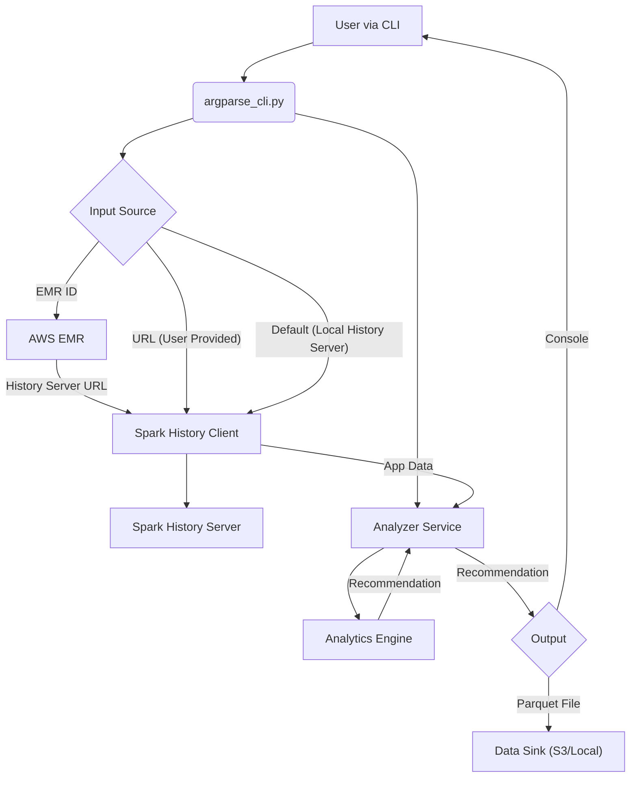

# Spark Application Analyzer

A Python package to analyze Spark Application (Spark 3.5 running on AWS EMR) metrics via REST API to suggest the right sizing for executors.

> This project is WIP and is NOT ready to use yet.

## Overview

This project implements a right-sizing framework for Spark executors, inspired by [LinkedIn's Right-Sizing Executor Design](https://www.linkedin.com/blog/engineering/infrastructure/right-sizing-spark-executor-memory). The framework analyzes historical Spark application metrics to automatically determine optimal executor memory configurations.

## Features

- **Automatic Metric Collection**: Fetches executor metrics from Spark History Server via REST API
- **EMR Integration**: Automatically discovers history server endpoints using EMR cluster ID
- **Memory Analysis**: Calculates p50, p90 percentiles for heap, total, and overhead memory
- **Right-Sizing Recommendations**: Implements LinkedIn-inspired formulas with dynamic buffer sizing
- **T-Shirt Sizing**: Maps recommendations to configurable cluster profiles (XSMALL to XLARGE)
- **Multiple Output Formats**: JSON output, Parquet storage, and human-readable logs
- **CLI-First Design**: Easy-to-use command-line interface for automation

## Installation

### Prerequisites

- Python 3.8+
- Access to Spark History Server (local or remote)
- AWS credentials (if using EMR integration)

### Install from Source

```bash
git clone <repository-url>
cd spark-application-analyzer
pip install -e .
```

### Install Dependencies

```bash
pip install -r requirements.txt
```

## Quick Start

### Basic Usage

```bash
# List available Spark applications
spark-analyzer list-apps --history-server-url http://localhost:18080

# Get executor metrics for a specific application
spark-analyzer get-metrics app-123 --history-server-url http://localhost:18080

# Analyze applications and generate recommendations
spark-analyzer analyze --history-server-url http://localhost:18080 --output-dir ./results
```

### Alternative CLI (argparse)

For integration into existing code, you can also use the argparse-based CLI:

```bash
python -m spark_application_analyzer.argparse_cli list-apps --history-server-url http://localhost:18080
python -m spark_application_analyzer.argparse_cli analyze --history-server-url http://localhost:18080 --output-dir ./results
```

### EMR Integration

```bash
# Automatically discover history server from EMR cluster
spark-analyzer analyze --emr-id j-1234567890 --output-dir ./results
```

## Configuration

### T-Shirt Sizing Profiles

Create a `config.yaml` file to define your cluster profiles:

```yaml
tshirt_profiles:
  XSMALL:
    max_memory_gb: 4
    max_cores: 2
  SMALL:
    max_memory_gb: 8
    max_cores: 4
  MEDIUM:
    max_memory_gb: 16
    max_cores: 8
  LARGE:
    max_memory_gb: 32
    max_cores: 16
  XLARGE:
    max_memory_gb: 64
    max_cores: 32
```

Use the configuration:

```bash
spark-analyzer analyze --history-server-url http://localhost:18080 --config-file config.yaml
```

## Architecture

```
spark_application_analyzer/
├── collectors/          # Metric collection from Spark History Server
├── models/             # Data models for metrics and recommendations
├── analytics/          # Memory analysis and right-sizing logic
├── storage/            # Arrow/Parquet storage and persistence
├── config/             # T-shirt sizing and configuration management
├── utils/              # Utility functions and helpers
└── cli.py             # Command-line interface
```

## Architecture Diagram



## Right-Sizing Logic

The framework implements LinkedIn's approach with the following key features:

### Memory Calculation
- **MAX_HEAP_MEMORY**: Peak JVM heap memory usage
- **MAX_TOTAL_MEMORY**: Total process memory from ProcessTree metrics
- **MAX_OVERHEAD_MEMORY**: Calculated as difference between total and heap

### Buffer Strategy
- **< 8 executions**: 25-30% buffer (conservative approach)
- **≥ 8 executions**: 10-15% buffer (aggressive optimization)

### Formulas
```
SUGGESTED_HEAP = p90(MAX_HEAP_MEMORY) + BUFFER * (p90_HEAP / p90_TOTAL)
SUGGESTED_OVERHEAD = p90(OVERHEAD_MEMORY) + BUFFER * (p90_OVERHEAD / p90_TOTAL)
```

## Output

### JSON Recommendations
```json
{
  "application_id": "app-123",
  "executor_id": "1",
  "current_heap_memory_gb": 8.0,
  "recommended_heap_memory_gb": 10.5,
  "current_total_memory_gb": 12.0,
  "recommended_total_memory_gb": 14.2,
  "buffer_percentage": 25.0,
  "percentile_gap_warning": false
}
```

### Parquet Storage
All metrics and recommendations are stored in Parquet format for easy querying and analysis.

## Development

### Setup Development Environment

```bash
pip install -e ".[dev]"
```

### Code Quality

```bash
# Format code
ruff format .

# Lint code
ruff check .

# Type checking
mypy spark_application_analyzer/

# Run tests
pytest
```

### Project Structure

- **collectors/**: Spark History Server API client
- **models/**: Dataclasses for metrics and recommendations
- **analytics/**: Memory analysis and right-sizing algorithms
- **storage/**: Arrow/Parquet I/O operations
- **config/**: Configuration management and t-shirt sizing
- **utils/**: Helper functions and logging setup

## Programmatic Usage

For programmatic use, the library provides a high-level `analyze_application` function that handles all component initialization and returns a complete recommendation object. This is the recommended way to integrate the analyzer into your own Python code.

### Example

```python
from spark_application_analyzer import analyze_application
from spark_application_analyzer.models.recommendation import Recommendation

# --- Example 1: Using an EMR Cluster ID ---
try:
    print("--- Analyzing application using EMR ID ---")
    # The function will automatically discover the Spark History Server URL
    recommendation: Recommendation = analyze_application(
        application_id="application_1678886400000_0001", # Replace with your app ID
        emr_id="j-12345ABCDEF" # Replace with your EMR ID
    )

    print("\n--- Analysis Complete ---")
    print(f"Application: {recommendation.app_name}")
    print(f"Recommended Executor Heap: {recommendation.suggested_heap_in_gb} GB")
    print(f"Recommended Executor Overhead: {recommendation.suggested_overhead_in_gb} GB")
    print(f"Recommended Max Executors: {recommendation.recommended_maxExecutors}")

except Exception as e:
    print(f"An error occurred: {e}")


# --- Example 2: Using a direct URL ---
try:
    print("\n--- Analyzing application using direct URL ---")
    recommendation: Recommendation = analyze_application(
        application_id="application_1678886400000_0002", # Replace with your app ID
        base_url="http://localhost:18080"
    )

    print("\n--- Analysis Complete ---")
    # The 'recommendation' object contains all the details
    print(recommendation)

except Exception as e:
    print(f"An error occurred: {e}")
```

### Using as a CLI tool

```bash
python3 spark_application_analyzer/argparse_cli.py --action get-recommendation --app-id application_1756176332935_0487
```

## Contributing

1. Fork the repository
2. Create a feature branch
3. Make your changes
4. Add tests for new functionality
5. Ensure all tests pass
6. Submit a pull request

## License

MIT License - see LICENSE file for details.

## Acknowledgments

- Inspired by [LinkedIn's Spark Right-Sizing Project](https://www.linkedin.com/blog/engineering/infrastructure/right-sizing-spark-executor-memory)
- Built with modern Python tooling (pyarrow, ruff)
- Designed for AWS EMR environments

## Roadmap

- [x] Executor Memory Recommendation
- [x] Num Executor Recommendation
- [ ] Stage metrics analysis for bottleneck identification
- [ ] Shuffle partition optimization recommendations
- [ ] Real-time monitoring and alerting
- [ ] Integration with Spark job submission
